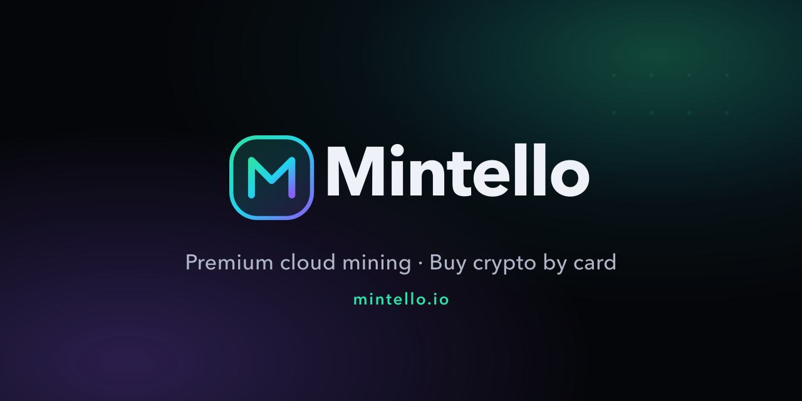

<!--
  Mintello — GitHub profile README.
  Commit banner.png next to this file and adjust the  path if needed:
    - Organisation account → repo ".github", path "profile/README.md" (+ "profile/banner.png")
    - User account         → repo "mintelloofficial", path "README.md" (+ "banner.png")
-->

  

  
  
  

---

### ⛏️ What is Mintello?

**Mintello** is a premium crypto platform combining **cloud mining server rental** with **instant crypto purchases by card** — wrapped in a fast, secure, fully multilingual experience.

- **Rent enterprise hashpower** and monitor your rigs on a real-time dashboard (hashrate, uptime, earnings).
- **Buy crypto by card** through a clean, guided checkout.
- **Secure by design** — hardened sessions, 2FA, audited custody, withdrawals validated manually.
- **Truly multilingual** — English, Français, Русский, 中文, 日本語.

### 🌐 Links

- 🔗 Website — **[mintello.io](https://mintello.io)**
- 🐦 X — **[@mintelloHQ](https://x.com/mintelloHQ)**
- 💬 Telegram — **[@MintelloOfficial](https://t.me/MintelloOfficial)**
- 🎵 TikTok — **[@mintello.official](https://www.tiktok.com/@mintello.official)**

### 🔐 Security

We will **never** DM you first, and we will **never** ask for your seed phrase or private keys. Always check the domain: **mintello.io**.

© Mintello — operated by METAL GEAR SAS · EU

