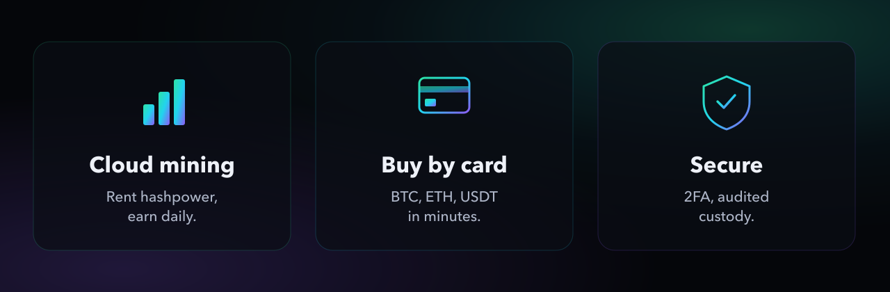

<!--
  Mintello — GitHub profile README (pro edition).
  Commit banner.png AND features.png next to this file; adjust  paths if needed:
    - Organisation account → repo ".github", path "profile/README.md" (+ images in "profile/")
    - User account         → repo "mintelloofficial", path "README.md" (+ images at root)
-->

  

<h1 align="center">Mintello</h1>

  <strong>Premium cloud mining &amp; buy crypto by card.</strong> 
  Secure&nbsp;·&nbsp;Multilingual&nbsp;·&nbsp;Built for scale.

  
  
  

  
  
  

 

  

---

## ✨ What is Mintello?

**Mintello** is a premium crypto platform that combines **cloud mining server rental** with **instant crypto purchases by card** — delivered through a fast, secure, fully multilingual experience.

- ⛏️ **Rent enterprise hashpower** and monitor your rigs on a real-time dashboard — hashrate, uptime and earnings, live.
- 💳 **Buy crypto by card** through a clean, guided checkout: BTC, ETH, USDT, SOL and 100+ assets.
- 🔐 **Secure by design** — 2FA, hardened sessions, audited custody, manually-validated withdrawals.
- 🌍 **Truly multilingual** — the entire product in English, Français, Русский, 中文 and 日本語.

## 🚀 Highlights

| | |
|---|---|
| ⚡ **Real-time dashboard** | Live hashrate, uptime &amp; earnings on any device |
| 🪙 **100+ assets** | Mine and buy the coins you actually want |
| 🤝 **Referral program** | Invite friends and earn from active referrals |
| 🛟 **Support, 5 languages** | Real humans, every day |
| 🇪🇺 **Real EU company** | Operated by METAL GEAR SAS — real accountability |

## 🛠️ Built with

  
  
  
  
  
  

## 🌍 Languages

`English` · `Français` · `Русский` · `中文` · `日本語` — the whole platform, localised end to end.

## 🔗 Links

| | |
|---|---|
| 🌐 Website | **[mintello.io](https://mintello.io)** |
| 🐦 X | **[@mintelloHQ](https://x.com/mintelloHQ)** |
| 💬 Telegram | **[@MintelloOfficial](https://t.me/MintelloOfficial)** |
| 🎵 TikTok | **[@mintello.official](https://www.tiktok.com/@mintello.official)** |

## 🔐 Security

We will **never** DM you first, and we will **never** ask for your seed phrase or private keys.
Always verify the domain: **`mintello.io`**.

 

  © Mintello — operated by METAL GEAR SAS · European Union

